# Automatic Localization of Optic Disc and Focea Center Points

This project aims to detect the center of optic disc and fovea using only image processing techniques (no machine learning) in fundus images. Moreover, the segmentation of optic disc has been done for the purpose of the localization.

## 1) Dataset

Indian Diabetic Retinopathy Image Dataset (<b>[IDRID](https://idrid.grand-challenge.org/Home/)</b>) is used for this project.

The images of this dataset have a resolution of <b>4288×2848</b> pixels and are stored in JPG file format. Moreover, the dataset covers three distinct subsets of problems: Localization, Segmentation and Disease Grading. I only focused on localization and segmentation problems for this study. 

    

        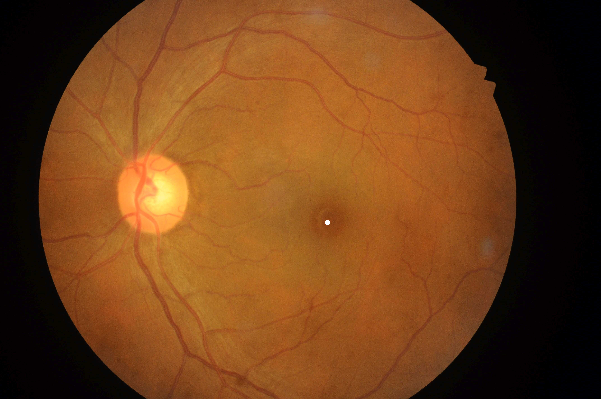
        
 <b>a)</b> Ground Truth of Fovea Localization

    

    

        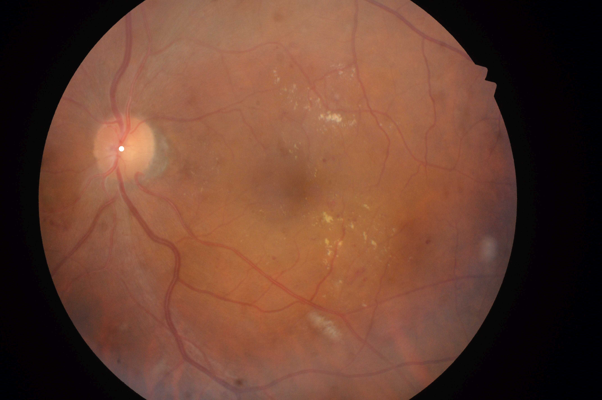
        
 <b>b)</b> Ground Truth of Optic Disc Localization

    

## 2) Processing Steps
<b>Localization</b> subset contains <b>413</b> sample images for training and <b>103</b> sample images for testing by including the center location of both the optic disc and fovea in CSV file format. Since this study does not address model training, I only used the test subset. 

<b>Segmentation</b> subset of the dataset contains <b>54</b> training and <b>27</b> testing samples with corresponding segmentation masks. For this problem, <b>U-Net</b>, one of the well-known image segmentation algorithms in deep learning, was used to compare the performance of image processing methods. 

### 2.1) Optic Disc Localization
As an approach, I realized that the brightest parts of the images are mostly the areas where the optic disc is located. Therefore, I applied the histogram equalization algorithm to increase contrast and make the optic disc brighter after converting color space of the image from RGB to grayscale. 

Since the brightest parts are closer to the white value (255), I applied binary thresholding with a predefined value of 250. In this step, I iterate this process by lowering the threshold value until finding an object of sufficient area size. Sometimes small regions exceed the threshold and create noise in the segmentation, which I prevented by applying an erosion operation. This algorithm also uses a heap (priority queue) data structure to store the biggest objects because optic discs have a huge space in the images.

    

        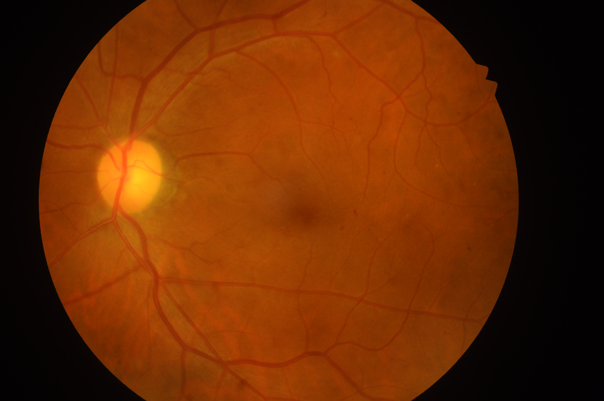
        
 <b>a)</b> Input Image

    

    

        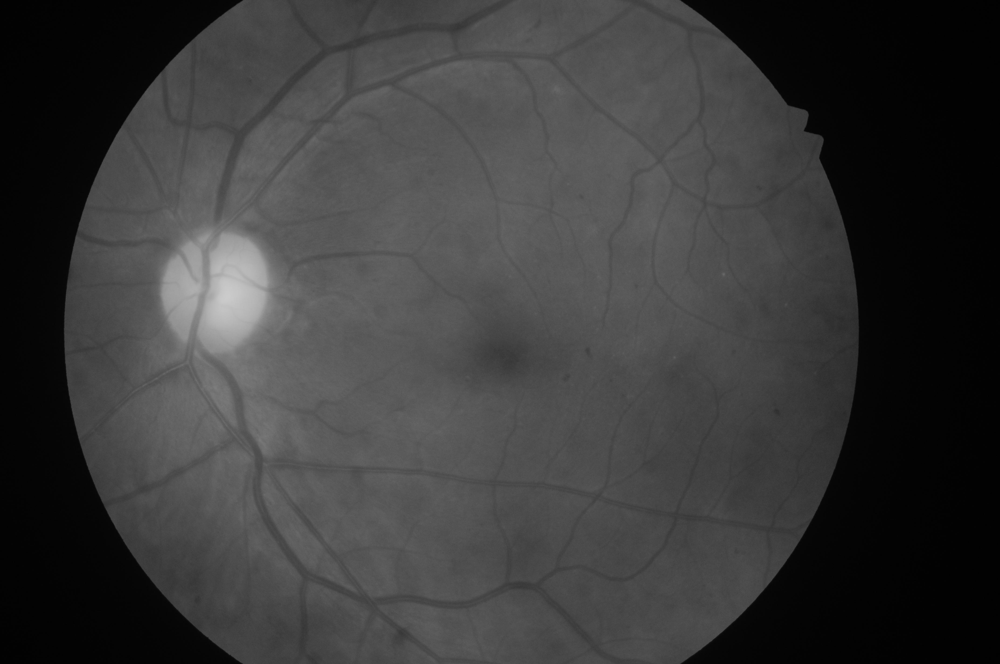
        
 <b>b)</b> Grayscale Image

    

    

        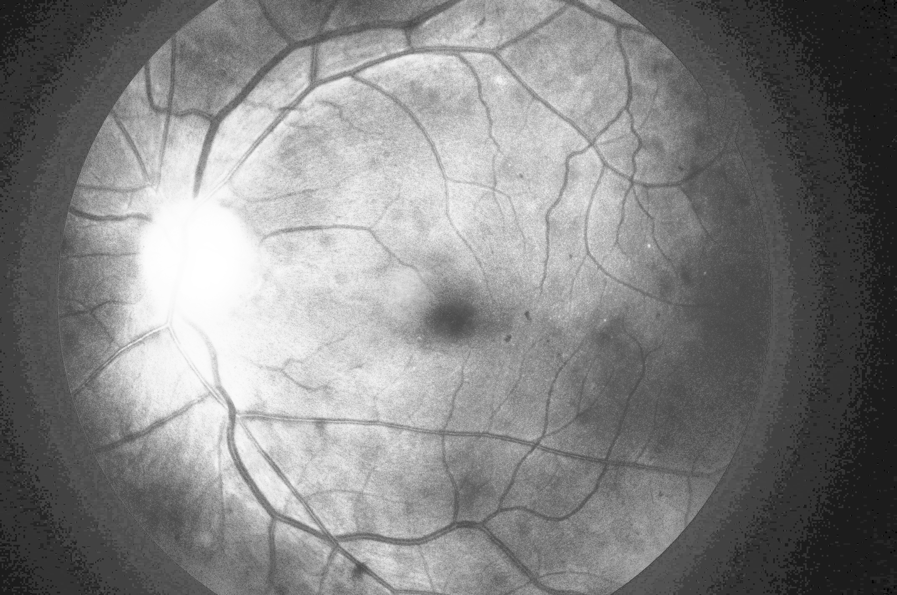
        
 <b>c)</b> Histogram Eqaulized Image

    

    

        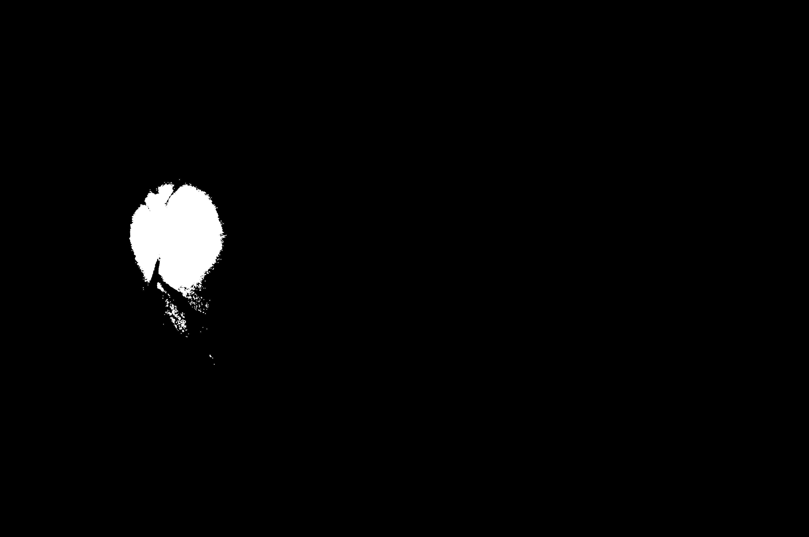
        
 <b>d)</b> Thresholded Image

    

### 2.2) Fovea Localization

Both optic disc and fovea detection require similar processing steps to achieve meaningful results. Therefore, I applied most of the same methods with small adjustments. Because the fovea usually represents a black area in images, it is difficult to distinguish it from other parts of the image, even with the human eye. Thus, to convert dark pixels into light ones, I first convert the images into negative ones.

 

After analyzing images,  the fovea is always close to the center of the fundus. For this reason, I applied a circle masking operation to extract the middle part of the image as a region of interest with a predefined radius value. Since the image is in RGB color space, I transformed it into a grayscale and applied histogram equalization to sharpen the brightness of the fovea. The remaining manipulations are the same as the optic disc detection algorithm: thresholding, erosion, storing the largest contours in a heap and finding the center of the area

    
        
        
 <b>a)</b> Input Image

    
    
        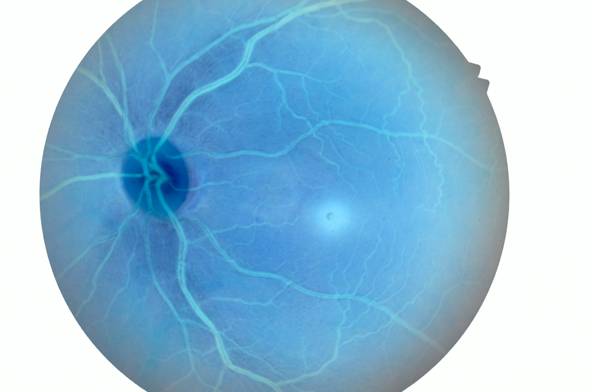
        
 <b>b)</b> Negative Image

    
    
        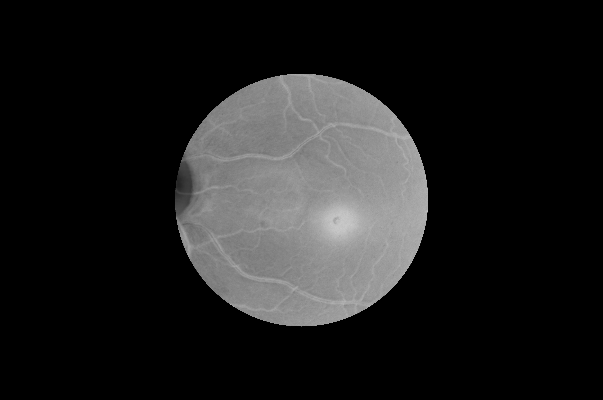
        
 <b>c)</b> Grayscale Masked Image

    

    
        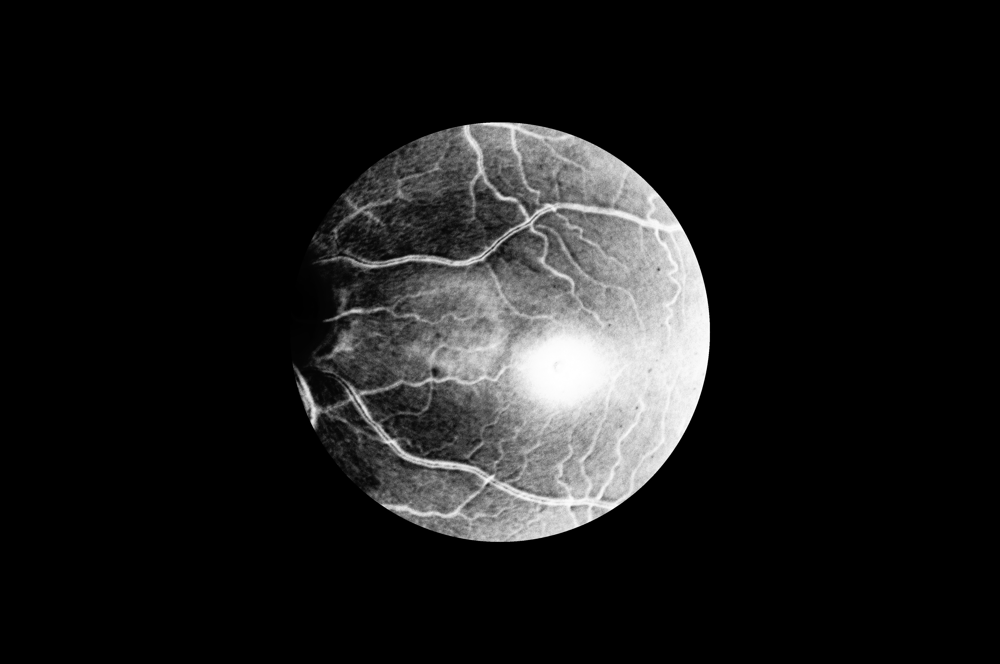
        
 <b>d)</b> Histogram Eqaulized Image

    
    
        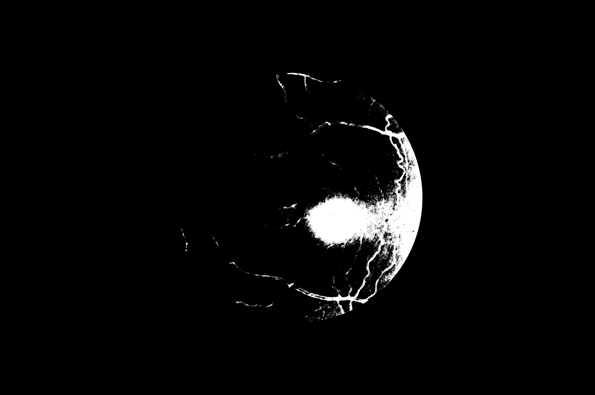
        
 <b>e)</b> Thresholded Image

    
    
        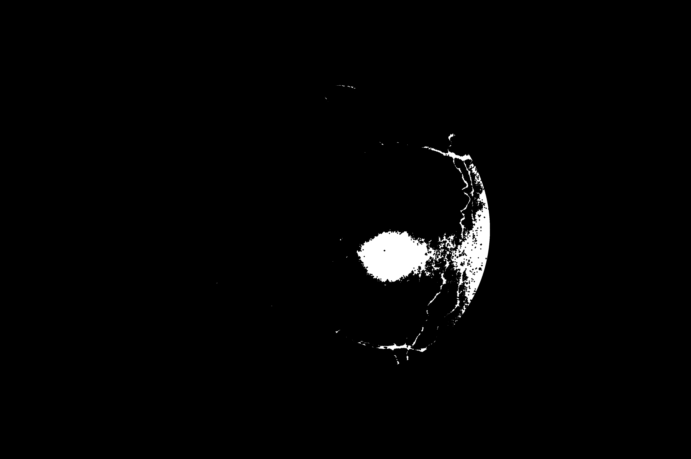
        
 <b>f)</b> Erosion Applied Image 

    

## 3) Experiments and Results

### 3.1) Human Level Performance

<ul>
    <li> I observed that this region is sometimes very challenging to detect,
<b>even for humans</b>.</li>
    <li>Therefore, I created a simple application with a user interface for human
subjects to test their performance to set a threshold for our image
processing pipeline. </li>
</ul>

    
        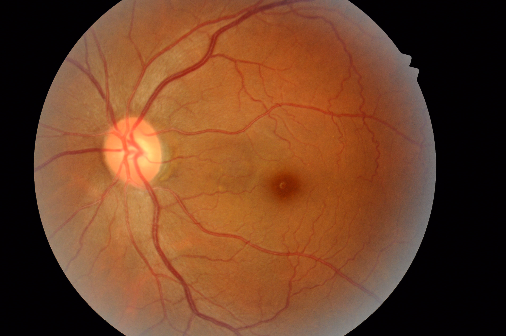
        
 <b>a)</b> Easy Example 

    
    
        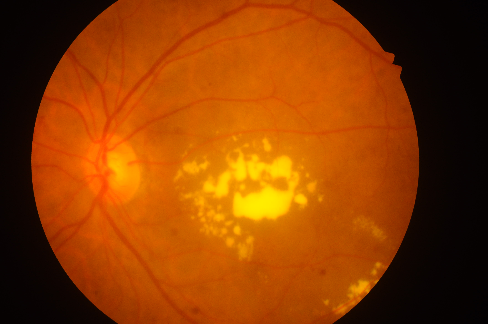
        
 <b>b)</b> Hard Example

    

### 3.2) Results of Fovea Localization in F1 Score

I have used F1 score for our metrics but this metric is designed for classification problem. Therefore, I made some adjustments to use it for my problems. I add a distance factor <b>d</b> to accept prediction true if the model find a coordinate which is equal or smaller than this factor. I have used this factor for both fovea and optic disc localization.
 

    <table style="border-collapse: collapse; width: 100%; max-width: 800px; text-align: center;">
        <thead>
            <tr>
                <th style="border: 1px solid #dddddd; padding: 8px;">Model</th>
                <th style="border: 1px solid #dddddd; padding: 8px;">d = 100</th>
                <th style="border: 1px solid #dddddd; padding: 8px;">d = 200</th>
                <th style="border: 1px solid #dddddd; padding: 8px;">d = 300</th>
                <th style="border: 1px solid #dddddd; padding: 8px;">d = 400</th>
                <th style="border: 1px solid #dddddd; padding: 8px;">d = 500</th>
            </tr>
        </thead>
        <tbody>
            <tr>
                <td style="border: 1px solid #dddddd; padding: 8px;">Human</td>
                <td style="border: 1px solid #dddddd; padding: 8px;">79.61%</td>
                <td style="border: 1px solid #dddddd; padding: 8px;">81.52%</td>
                <td style="border: 1px solid #dddddd; padding: 8px;">90.61%</td>
                <td style="border: 1px solid #dddddd; padding: 8px;">95.47%</td>
                <td style="border: 1px solid #dddddd; padding: 8px;">100%</td>
            </tr>
            <tr>
                <td style="border: 1px solid #dddddd; padding: 8px;">Ours</td>
                <td style="border: 1px solid #dddddd; padding: 8px;">53.46%</td>
                <td style="border: 1px solid #dddddd; padding: 8px;">77.67%</td>
                <td style="border: 1px solid #dddddd; padding: 8px;">86.41%</td>
                <td style="border: 1px solid #dddddd; padding: 8px;">87.38%</td>
                <td style="border: 1px solid #dddddd; padding: 8px;">93.20%</td>
            </tr>
        </tbody>
    </table>

### 3.3) Results of Optic Disc Localization in F1 Score

    <table style="border-collapse: collapse; width: 100%; max-width: 800px; text-align: center;">
        <thead>
            <tr>
                <th style="border: 1px solid #dddddd; padding: 8px;">Model</th>
                <th style="border: 1px solid #dddddd; padding: 8px;">d = 100</th>
                <th style="border: 1px solid #dddddd; padding: 8px;">d = 150</th>
                <th style="border: 1px solid #dddddd; padding: 8px;">d = 200</th>
                <th style="border: 1px solid #dddddd; padding: 8px;">d = 250</th>
                <th style="border: 1px solid #dddddd; padding: 8px;">d = 300</th>
            </tr>
        </thead>
        <tbody>
            <tr>
                <td style="border: 1px solid #dddddd; padding: 8px;">Ours</td>
                <td style="border: 1px solid #dddddd; padding: 8px;">75.73%</td>
                <td style="border: 1px solid #dddddd; padding: 8px;">94.17%</td>
                <td style="border: 1px solid #dddddd; padding: 8px;">96.12%</td>
                <td style="border: 1px solid #dddddd; padding: 8px;">96.12%</td>
                <td style="border: 1px solid #dddddd; padding: 8px;">97.09%</td>
            </tr>
        </tbody>
    </table>

### 3.4) Results of Optic Disc Segmentation in Dice Score

As I mentioned, I have used U-Net image segmentation algortithm to compare the performances of my model and a well-known deep learning model. I have used 54 training samples from dataset to train the U-Net model and 27 testing samples to measure the performance in dice score. You can see the hyperparameters I have used for U-Net algorithm: 

    <table style="border-collapse: collapse; width: 100%; max-width: 800px; text-align: center;">
        <tbody>
            <tr>
                <td style="border: 1px solid #dddddd; padding: 8px;"><strong>Input Size</strong></td>
                <td style="border: 1px solid #dddddd; padding: 8px;">512x256</td>
            </tr>
        </tbody>
        <tbody>
            <tr>
                <td style="border: 1px solid #dddddd; padding: 8px;"><strong>Learning Rate</strong></td>
                <td style="border: 1px solid #dddddd; padding: 8px;">10^-3</td>
            </tr>
        </tbody>
        <tbody>
            <tr>
                <td style="border: 1px solid #dddddd; padding: 8px;"><strong>Loss Function</strong></td>
                <td style="border: 1px solid #dddddd; padding: 8px;">Binary Cross-Entropy</td>
            </tr>
        </tbody>
        <tbody>
            <tr>
                <td style="border: 1px solid #dddddd; padding: 8px;"><strong>Optimizer</strong></td>
                <td style="border: 1px solid #dddddd; padding: 8px;">Adam</td>
            </tr>
        </tbody>
        <tbody>
            <tr>
                <td style="border: 1px solid #dddddd; padding: 8px;"><strong>Batch Size</strong></td>
                <td style="border: 1px solid #dddddd; padding: 8px;">6</td>
            </tr>
        </tbody>
        <tbody>
            <tr>
                <td style="border: 1px solid #dddddd; padding: 8px;"><strong>Epochs</strong></td>
                <td style="border: 1px solid #dddddd; padding: 8px;">150</td>
            </tr>
        </tbody>
    </table>

 
 

In the table below, I show overall performance for my image processing model and the U-Net algorithm. Since my model is not trained with any image, its preliminary results are promising.

    <table style="border-collapse: collapse; width: 100%; max-width: 800px; text-align: center;">
        <thead>
            <tr>
                <th style="border: 1px solid #dddddd; padding: 8px;">Model</th>
                <th style="border: 1px solid #dddddd; padding: 8px;">Dice Score</th>
            </tr>
        </thead>
        <tbody>
            <tr>
                <td style="border: 1px solid #dddddd; padding: 8px;">U-Net</td>
                <td style="border: 1px solid #dddddd; padding: 8px;">85.86%</td>
            </tr>
        </tbody>
        <tbody>
            <tr>
                <td style="border: 1px solid #dddddd; padding: 8px;">Ours</td>
                <td style="border: 1px solid #dddddd; padding: 8px;">72.55%</td>
            </tr>
        </tbody>        
    </table>

 
 

    
        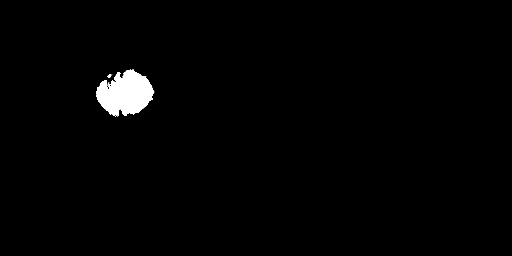
    
    
        
    
    
        
    

    
        
        
<b>Ours</b>

    
    
        
        
 <b>U-Net</b>

    
    
        
        
 <b>Ground Truth</b> 

    

